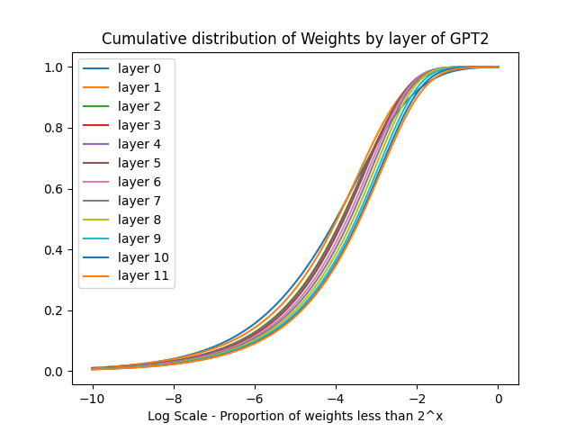

# CS 352 Lab 4: Sparsity and Large Langue Models

## Model Parameter Distribution

First, I will evaluate the number of parameters that are very close to 0 in three large language models. The models I chose were gpt2, a decoder only model, Roberta-large, an encoder only model, and Pegasus-large, an encoder decoder model. All models came from hugging face.

We can see that all of the models have a large fraction of their weights very close to 0. It's interesting to compare the other two models to pegasus, who has a relatively wider distribution.

Next, we'll look at the propotion of the wieghts close to 0 globally, then by layer:

Again, the most interesting model is the pegasus model. we can see that the wider distribution of weights also manifests in less weights close to 0. Even more interesting is the fact the the weights in pegsus follows an almost perfect log distribution. Meanwhile for GPT2 and Roberta there is a higher concentration of weights between [$2^{-6}, 2^{-2}$] and [$2^{-8}, 2^{-4}$] respectively.

Finally we'll look at the distribution of weights by layer for each model.

These graphs look very similar to the above graphs. For Roberta, there does not seem to be any sort of pattern between the layers. For both GPT2 and Pegasus, earlier layers seem to be slightly more sparse than later layers. This is in contrast to the trend that we say in lecture where later layers were more sparse than earlier layers. They theorized that htis was because sparsity in earlier layers would limit the number of features available for the rest of the model. However, given that these examples fly in the face of that pattern, I think this illustrates how little we understand about why the weights of large language models are distributed in such a fashion. It's also interesting to note that for pegasus, the log rule seen for global weights does not hold when looking at weights by layer. Also, for each the decoder is substantially more dense than the encoder, maybe suggesting why decoder only models have become more popular lately.

## Sparsifying Models

For the three example models, I sparsified them to the required thresholds ([0.1, 0.5, 0.9, 0.95, 0.99]) using unstructured global pruning. I used the l1 norm as the importance measure. This means that I considered all the weights from all the layers before finding weights the smallest 10% of weights. I then created a mask to set those weights to 0 and saved the new model. Although commonly this is done in an iterative fashion where only a small percentage of weights are zeroed before retraining, because of the computational cost of such a scheme, I always performed pruning in 1-shot. Then, during evaluation, I fine-tuned each sparse model on the specific task.

## Evaluation Results

### Causal Language Modeling

The first task I evaluated on was causal language modelling on the Wikitext dataset. This is often used as a pretraining task, so I thought it was a appropriate direct measure for how sparsity affected the results. Each model was finetuned on the dataset for three epochs with the same learning rate. We can see the preplexity without any sparsity approaches 1 for all of the models. This is indicative that the models had the capacity to predict the text before sparsifying. GPT2's performance degrades the fastest with induced sparsity while Roberta performs the best at high levels of sparsity. Both Roberta and Pegasus degrade only slightly up to a sparsity of 0.9, but then reach an elbow after that.

### GLUE Sentence Classification

I also evaluated the models on a the MRPC task of the GLUE (General Language UndErstanding) benchmark. This is a sentence classification task where the model has to predict weather a sentence is a correct paraphrase of a context. I was only able to evaluate GPT2 and Roberta on this benchmark because Pegasus does not have a sentence classification head. As above, both models were finetuned on the dataset for three epochs with the same learning rate. Both models perform reasonably well compared to their non sparse equivalent up to 10% sparsity. But degrade severely by 50% sparsity. It seems like there is some inherent floor in the benchmark for both models at around 68% accuracy. At a broader level, I think it's important to see that for a pretraining task (something the model did during training time) the performance of the models holds up better to higher levels of sparsity, but for downstream tasks performance is lost much quicker. I think this could be indicative that some of the smaller weights come from and contain more latent, subtle information that is helpful for downstream tasks.

## Model Size and Runtime

Pytorch/transformers currently does not support saving sparse models, nor does it offer software support for automatic sparsity. Also, I was running evaluation on A100 GPUs which do not offer hardware support for sparsity. Thus, both the size and the runtime of the sparse models was unaffected. This will be discussed more in the challenges section. For a full characterization of the runtime, please look in the results folder. However, as the variations there amount more to system noise than meaningful results, I chose not to include a figure.

## Challenges of Sparsification

Several challenges emerge when dealing with sparsification. Sparsity is somewhat of an emergent phenomenon, meaning weights of these over-parameterized neural networks naturally cluster around 0 even before we add any regularization or other methods to induce sparsity. This means that we do not fully understand how the initializations lead to mand 0 weights and few higher magnitude weights. This also means that it is hard to identify "important" weights when choosing weights to mask out. The L1 norm used in this report is a noisy indicator of importance, which is why it is common to use iterative methods to determine which weights to prune. More sophisticated method are continuing to energe to determine which weights to prune, but it is not a settled question. 

Even after recognizing sparsity or pruning to induce sparsity, sparse models still remain a challenge. First, support for storing an loading sparse models remain limited. There are several (software) methods to store sparse matrices, most supported within pytorch, but computing on these representations is significantly more expensive per-value than computing on dense matrices. Also, these methods take on the order of 2 to 3 times the space per non-zero value to store. Put together, this means matrices must be extremely sparse before sparse methods become more efficient than their dense counter par. Alternatively, emerging hardware can deal with sparse networks more efficiently by not moving around 0 values and not performing unnecessary. Historically, this has been a challenge because sparse computations destroy the regularity that GPU's and other such systems were designed for. 

